## {background-color="#43e911"}

::: {.container-aviso}
::: {.aviso-fullscreen}
**Dica para Celular:** Para melhor visualização, coloque o celular no modo horizontal.
Clique no **Menu (☰)** → **Tools** → **Fullscreen**.
:::
:::

---

## [Exercício 2: Transformada de Fourier Continua]{style="color: #f1da08; text-align: center; display: block;font-size: 1em;"} {background-color="#000000"}

::: {#lousa-senai}

::: {.fragment .escrita-estavel style="color: #dd35ff; font-family: 'Courier New', monospace; font-size: 1.3em;"}
Considere a equação diferencial representando a saída e entrada de um sistema $\dfrac{d^{4}y(t)}{dt^{4}} - 4\dfrac{d^{3}y(t)}{dt^{3}} - \dfrac{d^{2}y(t)}{dt^{2}} + 4\dfrac{dy(t)}{dt} = \dfrac{d^{4}x(t)}{dt^{4}} +  2x(t)$. Determine:

 * A Função de transferência.
 * A resposta ao impulso.
 * Analise a estabilidade e Causalidade.

:::

::: {.fragment style="color: #ff4343; font-family: 'Courier New', monospace; font-size: 1.5em;"}
Cálculo da função de transferência:
:::

::: {.fragment style="font-size: 0.9em;"}
$$\displaystyle (j\omega)^{4}Y(j\omega) - 4(j\omega)^{3}Y(j\omega) -(j\omega)^{2}Y(j\omega) + 4(j\omega)Y(j\omega) = (j\omega)^{4}X(j\omega) + 2X(j\omega)$$
:::

::: {.fragment style="font-size: 1.23em;"}
$$\displaystyle Y(j\omega)[(j\omega)^{4} - 4(j\omega)^{3} -(j\omega)^{2} + 4(j\omega)] = X(j\omega)[(j\omega)^{4} + 2]$$
:::

::: {.fragment style="font-size: 1.4em;"}
$$\displaystyle H(j\omega) = \dfrac{Y(j\omega)}{X(j\omega)} = \dfrac{(j\omega)^{4} + 2}{(j\omega)^{4} - 4(j\omega)^{3} -(j\omega)^{2} + 4(j\omega)}$$
:::

::: {.fragment .escrita-estavel style="color: #00eeff; font-family: 'Courier New', monospace; font-size: 1.5em;"}
Vamos efetuar a divisão de polinômio:
:::

::: {.fragment style="display: flex; justify-content: center; margin: 100px 0;"}
<iframe data-src="divisao.svg" width="1500" height="400" style="border:none; width: 100%; max-width: 1500px; height: 400px;"></iframe>
:::

::: {.fragment .escrita-estavel style="color: #00eeff; font-family: 'Courier New', monospace; font-size: 1.5em;"}
Então: 
:::

::: {.fragment .escrita-estavel style="color: #00eeff; font-family: 'Courier New', monospace; font-size: 0.9em;"}
$$\displaystyle (j\omega)^{4} + 2 = [(j\omega)^{4} - 4(j\omega)^{3} - (j\omega)^{2} + 4(j\omega)]\cdot 1 + 4(j\omega)^{3} + (j\omega)^{2} - 4(j\omega) + 2$$
:::

::: {.fragment style="border: 5px solid #f1da08; border-radius: 15px; margin: 20px auto; padding: 20px; width: 90%; box-sizing: border-box;"}
[**Assim, a função de transferência passa a ser:**]{style="color: #08e9f1; font-family: 'Courier New', monospace;font-size: 1.3em; display: block; margin-bottom: 10px;"}

::: {.fragment style="font-size: 0.9em;"}
$$\require{cancel}
\displaystyle H(j\omega) = \dfrac{\color{red}{\cancel{\color{white}{(j\omega)^{4} - 4(j\omega)^{3} - (j\omega)^{2} + 4(j\omega)}}}}{\color{red}{\cancel{\color{white}{(j\omega)^{4} - 4(j\omega)^{3} - (j\omega)^{2} + 4(j\omega)}}}} + \dfrac{4(j\omega)^{3} + (j\omega)^{2} - 4(j\omega) + 2}{(j\omega)^{4} - 4(j\omega)^{3} - (j\omega)^{2} + 4(j\omega)}$$
:::

::: {.fragment style="font-size: 1.5em;"}
$$\displaystyle  H(j\omega) = 1 + \dfrac{4(j\omega)^{3} + (j\omega)^{2} - 4(j\omega) + 2}{(j\omega)^{4} - 4(j\omega)^{3} - (j\omega)^{2} + 4(j\omega)}$$
:::
:::

::: {.fragment style="border: 5px solid #d608f1; border-radius: 15px; margin: 20px auto; padding: 20px; width: 90%; box-sizing: border-box;"}
[**Agora vamos fatorar o denominador de $H(j\omega)$.**]{style="color: #08e9f1; font-family: 'Courier New', monospace;font-size: 1.3em; display: block; margin-bottom: 10px;"}

::: {.fragment style="font-size: 1.5em;"}
$$\displaystyle H(j\omega) = 1 + \dfrac{4(j\omega)^{3} + (j\omega)^{2} - 4(j\omega) + 2}{(j\omega)^{4} - 4(j\omega)^{3} - (j\omega)^{2} + 4(j\omega)}$$
:::

::: {.fragment style="font-size: 1.5em;"}
$$\displaystyle H(j\omega) = 1 + \dfrac{4(j\omega)^{3} + (j\omega)^{2} - 4(j\omega) + 2}{(j\omega)^{3}[j\omega -4]-(j\omega)[j\omega -4]}$$
:::

::: {.fragment style="font-size: 1.5em;"}
$$\displaystyle H(j\omega) = 1 + \dfrac{4(j\omega)^{3} + (j\omega)^{2} - 4(j\omega) + 2}{(j\omega -4)[(j\omega)^{3}-(j\omega)]}$$
:::

::: {.fragment style="font-size: 1.5em;"}
$$\displaystyle H(j\omega) = 1 + \dfrac{4(j\omega)^{3} + (j\omega)^{2} - 4(j\omega) + 2}{(j\omega -4)(j\omega)[(j\omega)^{2}-1]}$$
:::

::: {.fragment style="font-size: 1.5em;"}
$$\displaystyle H(j\omega) = 1 + \dfrac{4(j\omega)^{3} + (j\omega)^{2} - 4(j\omega) + 2}{(j\omega -4)(j\omega)(j\omega-1)(j\omega+1)}$$
:::
:::

::: {.fragment style="border: 5px solid #d608f1; border-radius: 15px; margin: 20px auto; padding: 20px; width: 90%; box-sizing: border-box;"}
[**Após a fatoração, vamos decompor em frações parciais. O valor 1 da função de transferência corresponde ao valor do impulso, ou seja, $\delta(t)$.**]{style="color: #08e9f1; font-family: 'Courier New', monospace;font-size: 1.3em; display: block; margin-bottom: 10px;"}

::: {.fragment style="font-size: 1em;"}
$$\displaystyle \dfrac{4(j\omega)^{3} + (j\omega)^{2} - 4(j\omega) + 2}{(j\omega)^{4} - 4(j\omega)^{3} - (j\omega)^{2} + 4(j\omega)} = \dfrac{A}{j\omega -4} + \dfrac{B}{j\omega} + \dfrac{C}{j\omega + 1} + \dfrac{D}{j\omega - 1}$$
:::
:::

::: {.fragment style="border: 5px solid #000000; border-radius: 15px; margin: 20px auto; padding: 20px; width: 90%; box-sizing: border-box;"}
[**Cálculo para a constante A:**]{style="color: #08e9f1; font-family: 'Courier New', monospace;font-size: 1.3em; display: block; margin-bottom: 10px;"}

::: {.fragment style="font-size: 1.2em;"}
$$\displaystyle A\biggr|_{j\omega = 4} = \dfrac{4(j\omega)^{3} + (j\omega)^{2} - 4(j\omega) + 2}{(j\omega)(j\omega-1)(j\omega+1)} = \dfrac{258}{60} = 4,3$$
:::
:::

::: {.fragment style="border: 5px solid #000000; border-radius: 15px; margin: 20px auto; padding: 20px; width: 90%; box-sizing: border-box;"}
[**Cálculo para a constante B:**]{style="color: #08e9f1; font-family: 'Courier New', monospace;font-size: 1.3em; display: block; margin-bottom: 10px;"}

::: {.fragment style="font-size: 1.2em;"}
$$\displaystyle B\biggr|_{j\omega = 0,5} = \dfrac{4(j\omega)^{3} + (j\omega)^{2} - 4(j\omega) + 2}{(j\omega -4)(j\omega-1)(j\omega+1)} = \dfrac{2}{4} = \dfrac{1}{2} = 0,5$$
:::
:::

::: {.fragment style="border: 5px solid #000000; border-radius: 15px; margin: 20px auto; padding: 20px; width: 90%; box-sizing: border-box;"}
[**Cálculo para a constante C:**]{style="color: #08e9f1; font-family: 'Courier New', monospace;font-size: 1.3em; display: block; margin-bottom: 10px;"}

::: {.fragment style="font-size: 1.2em;"}
$$\displaystyle C\biggr|_{j\omega = -1} = \dfrac{4(j\omega)^{3} + (j\omega)^{2} - 4(j\omega) + 2}{(j\omega -4)(j\omega)(j\omega-1)} = -\dfrac{3}{10} = -0,3$$
:::
:::

::: {.fragment style="border: 5px solid #000000; border-radius: 15px; margin: 20px auto; padding: 20px; width: 90%; box-sizing: border-box;"}
[**Cálculo para a constante D:**]{style="color: #08e9f1; font-family: 'Courier New', monospace;font-size: 1.3em; display: block; margin-bottom: 10px;"}

::: {.fragment style="font-size: 1.1em;"}
$$\displaystyle D\biggr|_{j\omega = 1} = \dfrac{4(j\omega)^{3} + (j\omega)^{2} - 4(j\omega) + 2}{(j\omega -4)(j\omega)(j\omega+1)} = -\dfrac{3}{6} = -\dfrac{1}{2} =-0,5$$
:::
:::

::: {.fragment style="border: 5px solid #ff0000; border-radius: 15px; margin: 20px auto; padding: 20px; width: 90%; box-sizing: border-box;"}
[**Assim, $H(j\omega)$ será:**]{style="color: #08e9f1; font-family: 'Courier New', monospace;font-size: 1.3em; display: block; margin-bottom: 10px;"}

::: {.fragment style="font-size: 1.4em;"}
$$\displaystyle H(j\omega) = 1 + \dfrac{4,3}{j\omega - 4} + \dfrac{0,5}{j\omega} - \dfrac{0,3}{j\omega + 1} - \dfrac{0,5}{j\omega - 1}$$
:::
:::

::: {.fragment style="border: 5px solid #f1da08; border-radius: 15px; margin: 20px auto; padding: 20px; width: 90%; box-sizing: border-box;"}
[**Lembrando que:**]{style="color: #08e9f1; font-family: 'Courier New', monospace;font-size: 1.3em; display: block; margin-bottom: 10px;"}

::: {.fragment style="font-size: 1.5em;"}
$$\displaystyle \dfrac{(t - t_{0})^{n-1}}{(n-1)!}e^{-a(t - t_{0})}u(t-t_{0}) = \dfrac{e^{-j\omega t_{0}}}{(jw + a)^{n}}$$
:::
:::

::: {.fragment style="border: 5px solid #f1da08; border-radius: 15px; margin: 20px auto; padding: 20px; width: 90%; box-sizing: border-box;"}
[**Contudo, a resposta ao impulso $h(t)$ será:**]{style="color: #08e9f1; font-family: 'Courier New', monospace;font-size: 1.3em; display: block; margin-bottom: 10px;"}

::: {.fragment style="font-size: 1.4em;"}
$$\displaystyle h(t) = \delta(t) + [4,3e^{4t} + 0,5 - 0,3e^{-t} - 0,5e^{t}]u(t)$$
:::
:::

::: {.fragment .escrita-estavel style="color: #00eeff; font-family: 'Courier New', monospace; font-size: 1.5em;"}
A análise da resposta ao impulso $h(t)$ revela que o sistema é causal, pois sua resposta só existe para instantes de tempo $t \geq 0$, respeitando o princípio de causa e efeito. No entanto, o sistema é nitidamente instável, uma vez que sua expressão contém os termos exponenciais crescentes $e^{t}$ e $e^{4t}$. Como essas parcelas aumentam indefinidamente com a passagem do tempo, a saída do sistema "explode" em amplitude em vez de retornar ao repouso, o que caracteriza a falta de estabilidade.
:::

::: {.fragment .escrita-estavel style="color: #00eeff; font-family: 'Courier New', monospace; font-size: 1.5em;"}
[**Visualização da Resposta ao Impulso:**]{style="color: #43e911; display: block; margin-top: 20px;"}

{width=80%}

:::

::: {.fragment}
:::

:::
